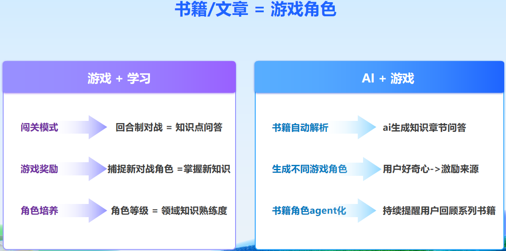

# 📚 BookMonster目标
学习新知识的时候总会遇到下面这些问题


这个项目结合大模型与游戏机制，打造一个集角色生成、对战、捕捉于一体的互动游戏， 让你碎片化学习自己收藏的书籍。

**背景**： 自从工作之后，学习时间变少，我想学新知识时就遇到下面几个问题：
想学的东西太多，但是短期不能学完就有压力
今天学了，过段时间比较忙容易忘记
下班之后觉得累没有动力持续学
经常零零散散刷知乎，公众号文章，但是没成体系。于是我就想能不能和游戏结合起来，然后想到以前玩的宝可梦这种回合制和宠物养成游戏

**想法**：把书变成游戏角色吧
1. 之后想一本书或文章变成一个宠物角色
2. 角色技能就是将内容碎片化成多个知识点的问答
游戏通过回合制问答的形式去让玩家学知识
3. 而 玩家通关后的角色升级进化和捕抓到新角色作为奖励机制，通过玩家好奇心让玩家持续玩下去
4. 玩家对某一个属性的多个怪物角色培养越好，说明对某一个领域越熟悉



# 🏗️ 组件架构


---

# ⚙️ 环境配置
## 运行环境
- 操作系统：Ubuntu 22.04
- Python：3.13.5
- GPU: 8G内即可
- 内存： 16GB

## (可选)🖥️ AMD mini 环境安装 ROCm & AMD GPU 驱动

参考：[安装教程](https://blog.gitcode.com/8d57100fe90a9e3067ab2824a03309bc.html)

安装后执行：

```shell
sudo usermod -a -G render $LOGNAME
sudo usermod -a -G video $LOGNAME
sudo reboot

# 检查是否成功
lsmod | grep amdgpu
rocm-smi
rocminfo
```

---

## 🐳 Docker 环境

- Docker 安装参考：[教程](https://mp.weixin.qq.com/s/OMtb1DL_ik2TvENzWHWGsg)
- 镜像源问题解决：[知乎教程](https://zhuanlan.zhihu.com/p/24228872523)

编辑 `daemon.json` 添加国内镜像源：

```json
{
  "registry-mirrors": [
    "https://docker.registry.cyou",
    "https://docker-cf.registry.cyou",
    ...
    "https://mirrors.tuna.tsinghua.edu.cn/",
    "http://mirrors.sohu.com/"
  ],
  "insecure-registries": [
    "registry.docker-cn.com",
    "docker.mirrors.ustc.edu.cn"
  ],
  "debug": true,
  "experimental": false
}
```

重启 Docker：

```shell
sudo systemctl restart docker
```

---

## 📦 打包 Conda 环境到 Docker 镜像

如需将 conda 环境打包进 Docker：

```shell
conda install -c conda-forge conda-pack
conda pack -n agent_env -o agent_env.tar.gz
```

示例 Dockerfile：

```dockerfile
FROM debian:buster-slim
RUN apt-get update && apt-get install -y bzip2 && rm -rf /var/lib/apt/lists/*
RUN mkdir -p /opt/env
COPY agent_env.tar.gz /opt/env/
RUN tar -xzf /opt/env/agent_env.tar.gz -C /opt/env && rm /opt/env/agent_env.tar.gz
ENV PATH /opt/env/bin:$PATH
RUN which python
RUN python --version
WORKDIR /app
COPY . /app
CMD ["python", "agent.py"]
```

---

## 🐍 Python 环境安装

- 推荐 Python 3.13.5

```shell
# 只需安装 requirements.txt
conda env create -n agent_env -f requirement.txt
# 或者
pip install -r requirement.txt
```

---

## 🌐 前端 pnpm & npm 安装

```shell
sudo apt install nodejs
sudo apt install npm
npm install -g pnpm
npm install next react react-dom
pnpm -v
```

---

# 🚀 运行方式

```shell
# 启动 docker + 前后端
cd docker/ && sh start_docker_services.sh start

# 仅启动后端
sh start_backend.sh

# 仅启动前端
sh start_front_end.sh
```

---

# 🧬 基础类角色对象

```python
monster_state = {
    monster_id: ...,
    monster_name: ...,
    monster_image: ...,
    attribute: ...,
    book_name: ...,
    book_id: ...,
    level: 1,
    exp: 0,
    maxHp: ...,
    currentHp: ...,
    attack: ...,
    defense: ...,
    speed: ...,
    skills: [
        {
            "question": ["question_id", "content", "difficulty"],
            "answer1": "",
            "answer2": "",
            "answer3": "",
            "answer4": "",
            "correct_answer": "1"
        },
        ...
    ]
}
```

> 💡 **说明**  
> - `skills` 列表中每个 question 对应角色攻击选项，4 个 answer 对应玩家技能选项。  
> - 玩家选择答案来回避或还击对方。  
> - 问题难度对应攻击值，`correct_answer` 为正确答案序号。

---

# 🛠️ 后端接口说明

### 1️⃣ 初始化用户选择角色  
**接口**: `/init_monster`  
**请求参数**: `{}`  
**返回结果**: `{monster: [monster_state_dict1, ...]}`  
> 游戏开始时返回角色列表，供玩家选择。

---

### 2️⃣ 生成对方角色  
**接口**: `/generate_bookmonster`  
**请求参数**:
```json
{
    "pdf": "pdf path",
    "image": "image path",
    "description": "description",
    "title": "monster title",
    "is_player": ...
}
```
**返回结果**:  
角色信息字典（不含 skills，skills 存于后端 ES 数据库）。

---

### 3️⃣ 角色对战  
**接口**: `/enemy_action`  
**请求参数**:
```json
{
    "monster_id": ...,
    "current_hp": ...,
    "health_state": ...,
    "player_monster_id": ...,
    "player_hp": ...,
    "player_state": ...,
    "player_win": false
}
```
**返回结果**:
```json
{
    "question": ["question_id", "content", "difficulty"],
    "answer1": "",
    "answer2": "",
    "answer3": "",
    "answer4": "",
    "correct_answer": "1"
}
```
> 返回大模型挑选的问题和答案作为下一轮对战的攻击和问题选项。

---

# 🎬 Demo 展示

- 📹 [BookMonster Demo 视频链接](./doc/demo.mp4)

**1. 上传文件文本多模态生成角色**  
<video controls src="doc/video/生成角色v4.mp4" title="Title"></video>

- 📹 [BookMonster 生成角色v4 视频链接](./doc/video/生成角色v4.mp4)


https://github.com/user-attachments/assets/59866c59-9b95-489b-94c8-63f0777093ca


**2. 角色对战和捕捉**  
<video controls src=" title="Title"></video>


https://github.com/user-attachments/assets/09a12dbc-b027-43b0-a7c5-9e8c4cf5c87b


- 📹 [BookMonster 捕捉怪物系统 视频链接](./doc/video/捕捉怪物系统.mp4)

---

# 📝 后续待办

- ✅ 添加数据库功能存放对战日志，创建的 monster 数据，前后端数据库交互
- ✅ 用 MCP 把多模态 LLM 接到 chat LLM 工具调用
- ❗ 支持 defend 和闪避功能
- ❗ 图片在线生成（目前为离线）
- ✅ 修复道具使用、BGM、精灵球功能
- ✅ 测试 redis、elasticsearch、MySQL、pdf parser、milvus 等在 docker 下的集成

---


> 📢 **欢迎贡献与反馈！**
- 小红书号(RedNote): 2224614234